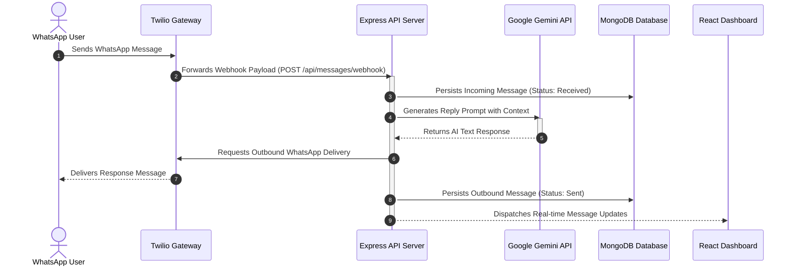

# 🤖 WhatsApp Gemini AI Chatbot

An intelligent, AI-powered WhatsApp chatbot built with Google's Gemini LLM API, enabling seamless two-way automated conversations through WhatsApp using Twilio integration and real-time React web dashboard monitoring.

[](https://react.dev/)
[](https://nodejs.org/)
[](https://expressjs.com/)
[](https://www.mongodb.com/)
[](https://ai.google.dev/)
[](https://www.twilio.com/)

---

## 📋 Project Description

This project is a full-stack WhatsApp chatbot application. It connects the **Google Gemini AI** language model for smart, context-aware conversational replies with the **Twilio WhatsApp API** for message routing. The system is backed by a Node.js + Express backend, utilizes a MongoDB database for persistent chat logs, and features a responsive React dashboard to inspect and manage chat sessions in real-time.

---

## 🏗️ System Architecture & Message Flow

The diagram below illustrates the message pipeline and data synchronization lifecycle when a patient or user interacts with the chatbot:



---

## 🛠️ Tech Stack Details

*   **Backend Runtime**: [Node.js](https://nodejs.org/) with [Express.js](https://expressjs.com/) REST API routing.
*   **LLM Model**: [Google Gemini AI (API)](https://ai.google.dev/) generating context-aware replies.
*   **Gateway**: [Twilio WhatsApp Sandbox](https://www.twilio.com/docs/whatsapp/sandbox) handling webhook routing.
*   **Database**: [MongoDB](https://www.mongodb.com/) with [Mongoose ODM](https://mongoosejs.com/) for persisting conversation logs.
*   **Frontend**: [React 18](https://react.dev/) scaffolded with [Vite](https://vite.dev/) for high-speed builds.
*   **CSS Style**: Clean, modern CSS layout with responsive grid.

---

## 📁 Repository Directory Structure

```text
whatsapp-gemini-chatbot/
├── backend/
│   ├── controllers/      # Handlers for webhooks and chat logs
│   ├── models/          # Mongoose database schema models (Message, ChatSession)
│   ├── routes/          # Express API route endpoints
│   ├── server.js        # Server configurations, DB connection, and middleware
│   ├── package.json     # Backend server dependencies
│   └── .env             # Environment variables (Twilio, MongoDB, Gemini keys)
├── frontend/
│   ├── src/             # React codebase (components, hooks, layouts)
│   ├── public/          # Static logos & favicon assets
│   ├── package.json     # Web App packages
│   └── vite.config.js   # Vite configuration settings
├── start_app.bat        # Automated double-start script for Windows
├── .gitignore           # Ignored files (locks, environment files, node_modules)
└── README.md            # Project documentation (this file)
```

---

## ⚙️ Installation & Setup Guide

### Prerequisites
*   [Node.js](https://nodejs.org/) (v16.0.0 or higher).
*   [MongoDB Instance](https://www.mongodb.com/cloud/atlas) (local server or MongoDB Atlas URI).
*   Active [Twilio Account](https://www.twilio.com/) with WhatsApp Sandbox enabled.
*   Google API Key from [Google AI Studio](https://aistudio.google.com/).

### 1. Clone & Install
```bash
# Clone the repository
git clone https://github.com/BGJ06/Chatbot-with-Gemini-LLM.git
cd Chatbot-with-Gemini-LLM

# Install backend dependencies
cd backend
npm install

# Install frontend dependencies
cd ../frontend
npm install
```

### 2. Configure Environment variables
Create a `.env` file in the `/backend` directory:
```env
PORT=5000
GEMINI_API_KEY=your_gemini_api_key_here
TWILIO_ACCOUNT_SID=your_twilio_account_sid_here
TWILIO_AUTH_TOKEN=your_twilio_auth_token_here
TWILIO_WHATSAPP_NUMBER=whatsapp:+14155238886
MONGODB_URI=your_mongodb_connection_string_here
```

### 3. Expose Localhost Webhook (Important)
Since Twilio needs a public URL to send incoming messages to your local Express server, you must set up a local port tunnel (e.g. using `ngrok`):
```bash
# Download ngrok, then expose port 5000 (Express port)
ngrok http 5000
```
Copy the generated public HTTPS URL (e.g., `https://abcd-123.ngrok-free.app`) and configure it in your **Twilio Sandbox Settings** as the Webhook URL for incoming messages:
`https://<your-ngrok-url>/api/messages/webhook`

---

## 🚀 Usage Instructions

### Run Automated Windows Startup Script
Double-click or run the provided batch script in the root directory:
```bash
start_app.bat
```
This script opens two terminal windows: one executing the Express backend server (port 5000) and another running the Vite dev server (port 5173).

### Run Manually

**Terminal 1 (Backend Server)**:
```bash
cd backend
npm start
```

**Terminal 2 (React Web Client)**:
```bash
cd frontend
npm run dev
```
Open **`http://localhost:5173`** in your browser to inspect conversation logs in real-time.

---

## 👨‍💻 Developer Credit

This platform was developed and is maintained by:
*   **Mithun Raj T** ([@BGJ06](https://github.com/BGJ06))

---

## 🙏 Acknowledgments

*   **Google AI** for the Gemini API.
*   **Twilio Dev Team** for the WhatsApp API sandbox.
*   **React & Vite Communities** for frontend toolchains.

---

## 📝 License
This project is licensed under the [MIT License](LICENSE).
